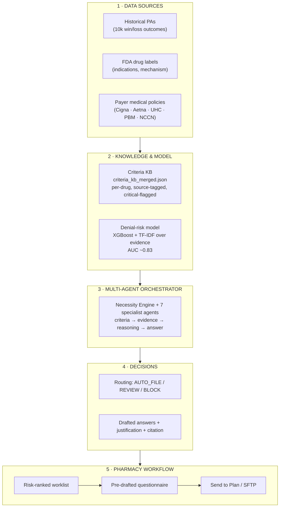
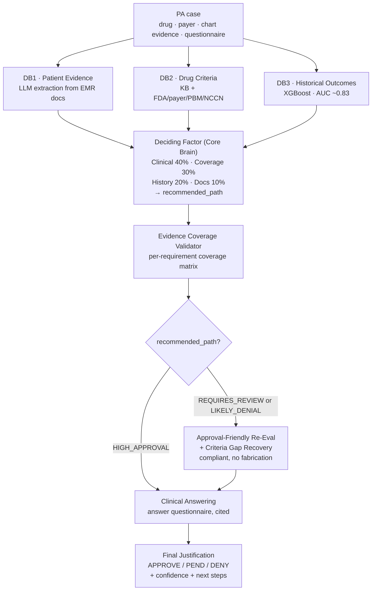
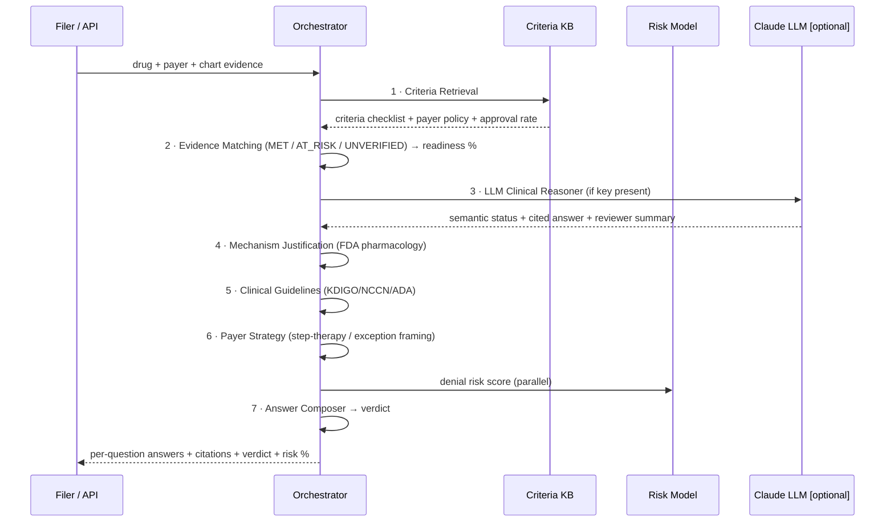
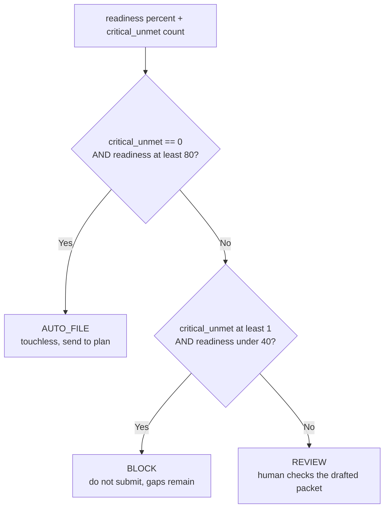
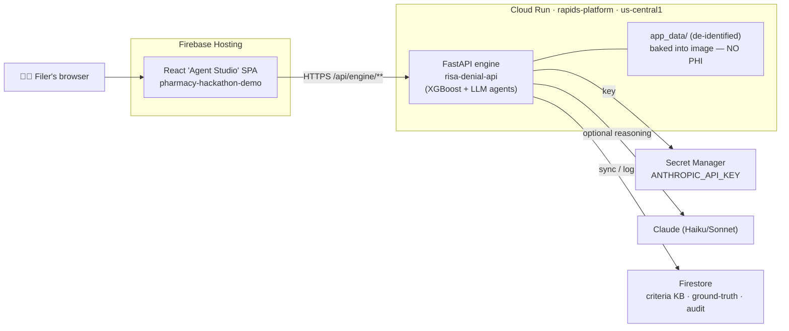
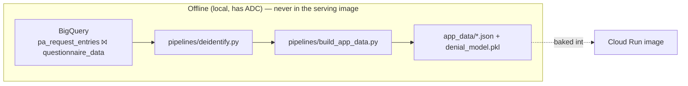
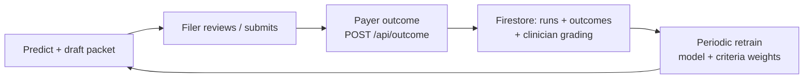

# RISA Approval Autopilot — Judges' Guide

> One guide to understand **what we built, how it works, and how to run it.**
> Every diagram below renders in any Markdown/Mermaid viewer (GitHub, VS Code,
> Cursor preview). Numbers trace to files in `app_data/` and `docs/`.

---

## 0. The 60-second mental model

Prior authorization (PA) is the insurer approval a pharmacy needs before
dispensing a drug. Today **~40% of pharmacy PAs are denied on the first pass** —
and most denials are *avoidable* (a missing lab, an undocumented prior therapy).

We built a system that, **before a PA is filed**:

1. **Predicts** denial risk (trained model, AUC ~0.83),
2. **Explains** the risk against the payer's actual coverage criteria,
3. **Drafts** each questionnaire answer *with a citation* to the chart, and
4. **Recovers** unmet criteria with legitimate clinical/appeal pathways —
   never fabricating facts, always leaving the human to click **Submit**.

> "We stopped *predicting* denials and started *preventing* them."

---

## 1. System architecture (the 5 layers)



**Read it top-down:** raw sources become structured *knowledge + a model*, which
feed a *team of agents*, which produce *decisions*, which slot into the *existing
pharmacy workflow* the filing team already uses. The hosted service runs only on
**de-identified data** — no PHI in the container.

---

## 2. The reasoning pipeline (Medical Necessity Engine v2)

This is the "brain." Three intelligence sources feed a weighted decision, a
coverage check, and a final justification. Independent stages run **in parallel**
(cutting ~8 sequential LLM calls to ~4, ~40s on Claude Haiku).



**The key idea:** the shipped **AUC-0.83 model is the referee.** The agents
propose a packet; the model judges its denial risk; for weak cases the loop adds
recovery pathways and re-answers until the case is as strong as the evidence
honestly allows.

---

## 3. The agent team (questionnaire orchestration)

`answer_questionnaire()` runs 7 specialist agents in order. Agents 1–2 + 4–7 are
deterministic (always run); agent 3 (LLM reasoner) activates when an API key is
present, otherwise the pipeline degrades gracefully to rule-based.



---

## 4. The decision gate (how a verdict is chosen)



A human is always in the loop for REVIEW/BLOCK; AUTO_FILE is reserved for
fully-covered, high-readiness cases.

---

## 5. Runtime & deployment (what runs where)





**Why two pictures:** training + PHI handling happen **offline**; the deployed
service ships only de-identified artifacts. That's the compliance backbone.

---

## 6. Closed-loop learning (how it gets smarter)



This loop is also our **validation source**: clinicians graded the AI's
per-criterion decisions (see Proof, §9).

---

## 7. How to run it (commands that work today)

From the repo root (`Makefile` is the source of truth — run `make help`):

```bash
# 1. Install the engine (editable) + pipeline/dev extras
python -m venv venv && source venv/bin/activate
make install-dev

# 2. (Optional) enable LLM reasoning
cp .env.example .env.engine.local      # add ANTHROPIC_API_KEY

# 3. Serve the API → http://localhost:8080  (interactive docs at /docs)
make run

# 4. Prove the model accuracy (deterministic, ~2s for 300 cases)
make simulate

# 5. Run the demo frontend (separate terminal)
cd frontend/pharmacy-app && npm ci && npm start
```

Deploy:

```bash
make deploy-backend     # → Cloud Run risa-denial-api (builds from source)
make deploy-frontend    # → Firebase Hosting pharmacy-hackathon-demo
```

Regenerate de-identified data from BigQuery (needs Application Default Creds):

```bash
make build-data         # python -m pipelines.build_app_data
```

---

## 8. Live demo path (what to click for judges)

1. Open the **Agents** tab (Agent Studio) → shows the live **architecture map**
   (drug/criteria/case counts pulled from `/api/criteria`).
2. Pick a **drug + payer**, paste chart evidence (or use a preset) → **Run**.
3. Watch the **7 agents fire in sequence**, each showing its real output.
4. End state: **risk gauge + verdict (AUTO_FILE/REVIEW/BLOCK) + drafted answers
   with citations.**
5. For a denied case: show the **red → green** recovery and the **cited diff**.

> Demo safety: hero cases are precomputed in `app_data/showcase_cases.json`; the
> live click replays a known-good result rather than gambling on a cold LLM call.

---

## 9. Proof (real numbers, with sources)

| Claim | Number | Source |
|-------|--------|--------|
| First-pass approval today | **60%** (6k/10k) | `app_data/summary.json` |
| Model lift from real evidence text | AUC **0.642 → 0.830** | `docs/TRANSFORMER_BRANCH.md` |
| Deterministic sim (300 cases) | **83.7%** acc · **92.4%** precision · +34.9-pt separation | `docs/MEDICAL_NECESSITY_ENGINE.md §5` |
| Closed-loop clinician agreement | **98.7%** · Cohen's κ **0.97** · F1 **0.983** (2,377 criteria) | `app_data/groundtruth_eval.json` |
| Addressable denials | **2,176 / 4,000 = 54.4%** | `app_data/triage.json` |
| Denial rate vs. contradictions | **33% → 58%** as contradictions rise | `app_data/insights.json` |
| Business impact | Conservative ~**$0.58M** · Target ~**$1.88M** | `config.py` / `docs/MOONSHOT_DECK.md` |

> Honesty note: the *retrospective recovery %* headline (Moonshot slide 8) is
> **not yet computed** — `app_data/recovery.json` does not exist. Don't present a
> recovery number until that script is run.

---

## 10. Doc map (where to read what)

| If a judge asks about… | Read |
|------------------------|------|
| The big picture / pitch | `docs/MOONSHOT_DECK.md` |
| This guide / architecture & diagrams | `docs/JUDGES_GUIDE.md` (here) |
| The reasoning brain, scaling, results | `docs/MEDICAL_NECESSITY_ENGINE.md` |
| The 7-agent team + API surface | `docs/AGENT_ARCHITECTURE.md` |
| Plain-language explainer (for clinicians) | `docs/FOR_THE_FILING_TEAM.md` |
| HPC / ClinicalBERT experiment | `docs/TRANSFORMER_BRANCH.md` |
| Vector-vs-graph storage decision | `docs/GRAPH_KB_RESEARCH.md` |
| Demo run-of-show + Q&A | `docs/DEMO_SCRIPT.md` · `docs/QA_PREP.md` |
| Repo layout / quickstart / API table | `README.md` |

---

## 11. The one-paragraph summary (for the judge who reads nothing else)

> We built a deployed, multi-agent system that prevents avoidable pharmacy PA
> denials. A trained model (AUC 0.83, validated against clinician grading at 98.7%
> agreement) scores denial risk; a team of LLM + rule-based agents reads the chart,
> matches it against each payer's real criteria, and drafts cited answers; and a
> compliant recovery layer surfaces legitimate pathways for unmet criteria — never
> fabricating facts, always leaving submission to a human. It runs on Cloud Run with
> zero PHI in the image, and it's grounded entirely in RISA's real data.
