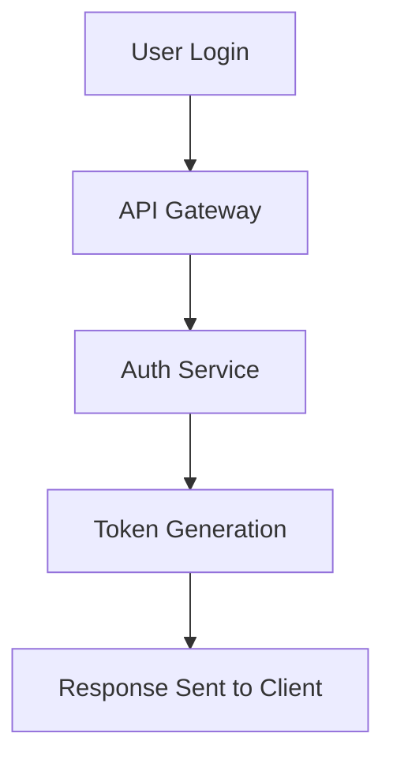

# PR Summary Structure Specification

When generating or updating a pull request (PR) description in response to a comment containing `@summary`, follow this structure and formatting exactly.

---

## Header

Each PR summary should begin with a clear, human-readable title and metadata block in the following format:

# Pull Request Summary

**Branch:** `{{branch_name}}`  
**Last Updated:** `{{current_date}}`

`{{branch_name}}` → the name of the branch associated with the PR (e.g., `feature/add-auth`)  
`{{current_date}}` → current date formatted as **DD MMM YYYY** (e.g., 08 Nov 2025)

---

## Overview

Provide a concise explanation of what this PR accomplishes.  
This section should answer **what changed**, **why**, and **how** it impacts the system.

**Example:**

```markdown
## Overview

This PR introduces OAuth2-based authentication for all API endpoints.  
It replaces the existing token system with a secure, standards-compliant workflow.
```

---

## Change Summary

List categorized changes derived from commit messages or PR titles, grouped as follows:

### 🟩 Features

Include all commits containing:

- feat
- feature
- add

### 🐛 Fixes

Include all commits containing:

- fix
- bug
- error

### ⚙️ Enhancements

Include all commits containing:

- enhance
- improve
- refactor

### 🗂️ Others

Include all remaining commits or messages not matching the above.

**Example:**

```markdown
## Change Summary

### 🟩 Features

- feat: Add multi-tenant login support
- Added audit trail for user logins

### 🐛 Fixes

- fix: Resolve null reference in login middleware

### ⚙️ Enhancements

- refactor: Simplified token validation logic

### 🗂️ Others

- chore: Updated dependencies
```

---

## Flow Diagram (Optional)

If the PR introduces significant logic, workflows, or data flow changes, include a Mermaid diagram to visualize the flow.  
Only include if applicable.

**Example:**



---

## Testing & Validation

Include steps or notes on how the changes were tested.

**Example:**

```markdown
## Testing & Validation

- Verified login with valid and invalid credentials
- Checked backward compatibility with old tokens
- Unit tests: 25 added, 2 modified
```

---

## Impact & Notes

Summarize any potential risks, dependencies, or migration steps required.

**Example:**

```markdown
## Impact & Notes

- Requires new environment variable: `OAUTH_SECRET_KEY`
- Database migration script included
```

---

## Formatting Rules

- Always overwrite any existing auto-generated summary (between `<!-- AUTO-SUMMARY:START -->` and `<!-- AUTO-SUMMARY:END -->`).
- Keep all section headers in the same order:
  1. Header
  2. Overview
  3. Change Summary
  4. Flow Diagram (optional)
  5. Testing & Validation
  6. Impact & Notes
- Use consistent Markdown formatting (`##` for main sections, `###` for subsections).
- Use bullet points (`-`) for lists and maintain one blank line between sections.
- Ensure the Markdown renders correctly on GitHub.
