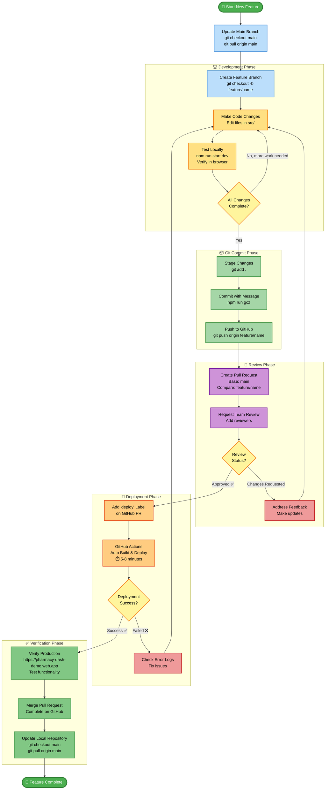

# Pharmacy Dashboard - Setup & Operations Guide

A comprehensive React-based dashboard application for pharmaceutical prior authorization workflows. This guide will help you set up, run, and deploy the application.

## 📑 Table of Contents

- [Quick Start](#-quick-start)
- [Prerequisites](#-prerequisites)
- [Initial Setup](#-initial-setup)
- [Running the Application](#-running-the-application)
- [Making Changes](#-making-changes)
- [Deployment](#-deployment)
- [Common Tasks](#-common-tasks)
- [Project Structure](#-project-structure)
- [Troubleshooting](#-troubleshooting)
- [Additional Resources](#-additional-resources)

---

## 🚀 Quick Start

For experienced developers who want to get started immediately:

```bash
# Clone and navigate to project
cd pharmacy-dashboard-demo

# Install dependencies
npm install

# Create environment file (see Initial Setup for required variables)
cp .env.example .env.development  # (you'll need to create this with actual values)

# Start development server
npm run start:dev
```

The application will be available at http://localhost:3000

---

## 🎯 Complete Workflow Overview

Here's the complete process from making a change to deploying it to production:



### Quick Command Reference

```bash
# Start fresh
git checkout main && git pull origin main

# Create new branch
git checkout -b feature/your-feature-name

# Make changes, then:
git add .
npm run gcz
git push origin feature/your-feature-name

# Then on GitHub:
# 1. Create Pull Request (base: main)
# 2. Get approval
# 3. Add "deploy" label
# 4. Wait for auto-deployment
# 5. Verify at https://pharmacy-dash-demo.web.app
# 6. Merge PR
```

**Estimated time:** Development (varies) + Review (1-24 hours) + Deployment (5-8 minutes)

---

## 📋 Prerequisites

Before you begin, ensure you have the following installed on your machine:

### Required Software

1. **Node.js** (v18.x or v20.x recommended)
   - Download from: https://nodejs.org/
   - Verify installation: `node --version`
   - Should output: `v18.x.x` or `v20.x.x`

2. **npm** (comes with Node.js, v8 or higher)
   - Verify installation: `npm --version`
   - Should output: `8.x.x` or higher

3. **Git**
   - Download from: https://git-scm.com/
   - Verify installation: `git --version`

4. **Firebase CLI** (for deployment)

   ```bash
   npm install -g firebase-tools
   ```

   - Verify installation: `firebase --version`

### Required Access

1. **Firebase Projects**
   - Development: `rapids-platform`
   - Production: `rapids-platform`
   - Contact your team lead to get added to these projects

2. **Environment Variables**
   - You'll need Firebase configuration values
   - API credentials for RISA backend services
   - Contact your team lead for these values

---

## 🛠️ Initial Setup

Follow these steps carefully for first-time setup:

### Step 1: Clone the Repository

```bash
git clone <repository-url>
cd pharmacy-dashboard-demo
```

### Step 2: Install Dependencies

```bash
npm install
```

This will install all required packages. The installation may take 3-5 minutes.

### Step 3: Set Up Environment Variables

Create two environment files in the project root:

#### `.env.development` (for local development)

```bash
# Firebase Configuration - Development
REACT_APP_FIREBASE_API_KEY=your_dev_api_key
REACT_APP_FIREBASE_AUTH_DOMAIN=rapids-platform.firebaseapp.com
REACT_APP_FIREBASE_PROJECT_ID=rapids-platform
REACT_APP_FIREBASE_STORAGE_BUCKET=rapids-platform.firebasestorage.app
REACT_APP_FIREBASE_MESSAGING_SENDER_ID=your_dev_sender_id
REACT_APP_FIREBASE_APP_ID=your_dev_app_id

# Environment
REACT_APP_ENV=development

# API Authentication (RISA Backend)
REACT_APP_USERNAME=your_api_username
REACT_APP_PASSWORD=your_api_password

# Optional: API URLs (if different from default)
# REACT_APP_API_BASE_URL=https://api-dev.risalabs.ai
```

#### `.env.production` (for production builds)

```bash
# Firebase Configuration - Production
REACT_APP_FIREBASE_API_KEY=your_prod_api_key
REACT_APP_FIREBASE_AUTH_DOMAIN=rapids-platform.firebaseapp.com
REACT_APP_FIREBASE_PROJECT_ID=rapids-platform
REACT_APP_FIREBASE_STORAGE_BUCKET=rapids-platform.firebasestorage.app
REACT_APP_FIREBASE_MESSAGING_SENDER_ID=your_prod_sender_id
REACT_APP_FIREBASE_APP_ID=your_prod_app_id

# Environment
REACT_APP_ENV=production

# API Authentication (RISA Backend)
REACT_APP_USERNAME=your_api_username
REACT_APP_PASSWORD=your_api_password

# Optional: API URLs (if different from default)
# REACT_APP_API_BASE_URL=https://api.risalabs.ai
```

**⚠️ Important Notes:**

- Never commit `.env` files to Git (they're in `.gitignore`)
- Contact your team lead for the actual values to use
- Keep production credentials secure

### Step 4: Configure Firebase CLI

Authenticate with Firebase:

```bash
firebase login
```

This will open a browser window for authentication. Sign in with your Google account that has access to the Firebase projects.

Verify you have access:

```bash
firebase projects:list
```

You should see `rapids-platform` in the list.

### Step 5: Verify Setup

Test that everything is working:

```bash
npm run start:dev
```

The application should:

1. Compile successfully
2. Open in your browser at http://localhost:3000
3. Show the login page

If you see the login page, your setup is complete! 🎉

---

## 🏃‍♂️ Running the Application

### Development Mode (Recommended for local work)

```bash
npm run start:dev
```

This command will:

- Start the React development server on http://localhost:3000
- Watch and compile SCSS files automatically
- Auto-format code with Prettier on file changes
- Enable hot-reloading (changes appear instantly in browser)
- Use development environment variables

**What happens when you run this:**

1. Terminal shows "Compiled successfully!"
2. Browser opens automatically to http://localhost:3000
3. You'll see three processes running (indicated by different colors in terminal):
   - Cyan: SCSS compilation
   - Yellow: React dev server
   - Green: Prettier formatting

**To stop:** Press `Ctrl+C` in the terminal

### Production Mode (for testing production build locally)

```bash
npm run start:prod
```

This uses production environment variables but runs the development server.

### Common Development Commands

| Command              | Purpose                                   | When to Use                      |
| -------------------- | ----------------------------------------- | -------------------------------- |
| `npm run start:dev`  | Start development server with dev config  | Daily development work           |
| `npm run start:prod` | Start development server with prod config | Testing with production data     |
| `npm run build:dev`  | Build for development deployment          | Before deploying to staging      |
| `npm run build:prod` | Build for production deployment           | Before deploying to production   |
| `npm run build-css`  | Compile SCSS once                         | If CSS changes aren't reflecting |
| `npm run test`       | Run test suite                            | Before committing changes        |

---

## 📚 Git Basics for Product Team

If you're new to Git, this section will help you understand the basics before making changes.

### What is Git?

Git is a version control system that:

- Tracks all changes to your code
- Allows multiple people to work on the same project
- Lets you go back to previous versions if needed
- Helps manage different versions (branches) of the code

### Understanding Branches

Think of branches like parallel universes of your code:

- **`main` branch** = Production code (what users see)
- **Feature branches** = Where you make changes safely without affecting production

```
main branch:          A --- B --- C --- D
                              \
feature branch:                E --- F --- G
```

When ready, you merge your feature branch back into main:

```
main branch:          A --- B --- C --- D --- H (merged)
                              \           /
feature branch:                E --- F --- G
```

### Essential Git Commands

Here are the commands you'll use daily:

```bash
# Check which branch you're on
git branch
# Output shows all branches, with * next to the current one

# Check what files you've changed
git status
# Shows modified, added, or deleted files

# See the actual changes you made
git diff
# Shows line-by-line differences

# Switch to a different branch
git checkout branch-name
# Example: git checkout main

# Create a new branch and switch to it
git checkout -b new-branch-name
# Example: git checkout -b feature/add-search

# Get latest changes from GitHub
git pull origin main
# Downloads and merges changes from the remote repository

# Stage files for commit (prepare to save changes)
git add .
# Adds all changed files, or specify individual files

# Commit changes (save with a message)
npm run gcz
# Opens interactive prompt for a proper commit message

# Push your changes to GitHub
git push origin branch-name
# Uploads your commits to GitHub

# Update your local main branch
git checkout main
git pull origin main
```

### Common Git Scenarios

#### Scenario 1: Starting Fresh Each Day

```bash
# 1. Go to main branch
git checkout main

# 2. Get latest changes
git pull origin main

# 3. Now you're up to date!
```

#### Scenario 2: Switching Between Tasks

```bash
# You're on feature/task-a but need to work on task-b

# 1. Save current work first
git add .
npm run gcz
git push origin feature/task-a

# 2. Switch to main and update
git checkout main
git pull origin main

# 3. Create new branch for task-b
git checkout -b feature/task-b
```

#### Scenario 3: Oops, I'm on the Wrong Branch

```bash
# You made changes but you're on main instead of a feature branch!

# 1. Stash your changes (temporary save)
git stash

# 2. Create the correct branch
git checkout -b feature/correct-branch

# 3. Apply your changes to this branch
git stash pop

# 4. Now commit as normal
git add .
npm run gcz
```

#### Scenario 4: Someone Else Updated Main

```bash
# Your branch is behind main

# 1. Commit your current work
git add .
npm run gcz

# 2. Switch to main and update
git checkout main
git pull origin main

# 3. Switch back to your branch
git checkout feature/your-branch

# 4. Merge main into your branch
git merge main

# 5. If there are conflicts, VS Code will show them
# Edit the files to resolve conflicts, then:
git add .
git commit -m "Merge main into feature branch"

# 6. Push updated branch
git push origin feature/your-branch
```

### Understanding Git Status

When you run `git status`, you'll see:

```bash
On branch feature/my-feature
Changes not staged for commit:
  modified:   src/components/Button.tsx

Untracked files:
  src/components/NewComponent.tsx
```

**What this means:**

- **Changes not staged**: Files you modified but haven't added yet
- **Untracked files**: New files Git hasn't seen before

**What to do:**

```bash
git add .              # Stage all changes
npm run gcz            # Commit with proper message
```

### Git Best Practices

1. **Commit often**
   - Small, frequent commits are better than large ones
   - Each commit should be one logical change

2. **Write good commit messages**
   - Use `npm run gcz` for proper format
   - Be descriptive: "Add patient search" not "Updated files"

3. **Pull before you push**
   - Always `git pull origin main` before starting work
   - Prevents conflicts

4. **Keep branches focused**
   - One feature = one branch
   - Don't mix unrelated changes

5. **Don't commit broken code**
   - Always test before committing
   - Your code should work

### Need Help with Git?

- **See what you changed**: `git diff`
- **Undo unstaged changes**: `git checkout -- filename`
- **Undo last commit** (keep changes): `git reset --soft HEAD~1`
- **Discard all changes**: `git reset --hard` (⚠️ Use carefully!)
- **See commit history**: `git log --oneline`

---

## 🔨 Making Changes

### Complete Development Workflow

Follow this step-by-step workflow when making any changes to the codebase:

#### Step 1: Create a New Branch from Main

Always start by creating a new branch from the `main` branch:

```bash
# 1. Make sure you're on the main branch
git checkout main

# 2. Get the latest changes from the remote repository
git pull origin main

# 3. Create a new branch for your feature or fix
# Branch naming convention: feature/description or fix/description
git checkout -b feature/your-feature-name
# or
git checkout -b fix/bug-description

# Examples:
# git checkout -b feature/add-patient-search
# git checkout -b fix/date-picker-timezone
# git checkout -b feature/update-status-colors
```

**Branch Naming Best Practices:**

- Use lowercase and hyphens
- Start with `feature/` for new features
- Start with `fix/` for bug fixes
- Use descriptive names that explain what you're changing
- Keep it concise but clear

**Verify you're on the new branch:**

```bash
git branch
# The active branch will have an asterisk (*) next to it
```

#### Step 2: Start the Development Server

```bash
npm run start:dev
```

This will:

- Open http://localhost:3000 in your browser
- Watch for file changes and auto-reload
- Compile SCSS automatically
- Format code with Prettier

#### Step 3: Make Your Changes

1. **Locate the files you need to edit**
   - Use VS Code's file search: `Cmd/Ctrl + P`
   - Or search for text: `Cmd/Ctrl + Shift + F`

2. **Edit the files**
   - Make your changes in the `src/` directory
   - Changes will automatically appear in the browser

3. **Check your changes**
   - View in browser at http://localhost:3000
   - Check browser console for errors: `F12` → Console tab
   - Test the functionality thoroughly

#### Step 4: Check What Changed

Before committing, review what you've changed:

```bash
# See which files were modified
git status

# See the actual changes in each file
git diff

# See changes for a specific file
git diff src/path/to/file.tsx
```

#### Step 5: Stage Your Changes

```bash
# Stage all changes
git add .

# Or stage specific files
git add src/path/to/file1.tsx src/path/to/file2.tsx

# Verify what's staged
git status
```

#### Step 6: Commit Your Changes

Use Commitizen for properly formatted commits:

```bash
npm run gcz
```

This will open an interactive prompt:

```
? Select the type of change that you're committing: (Use arrow keys)
❯ feat:     A new feature
  fix:      A bug fix
  docs:     Documentation only changes
  style:    Changes that do not affect the meaning of the code
  refactor: A code change that neither fixes a bug nor adds a feature
  perf:     A code change that improves performance
  test:     Adding missing tests

? What is the scope of this change (e.g. component or file name): (press enter to skip)
? Write a short, imperative tense description of the change:
? Provide a longer description of the change: (press enter to skip)
? Are there any breaking changes? (y/N)
? Does this change affect any open issues? (y/N)
```

**Example Commit Messages:**

- `feat(worklist): add patient search filter`
- `fix(date-picker): resolve timezone offset issue`
- `style(buttons): update primary button colors`
- `refactor(api): extract common request logic`

#### Step 7: Push Your Branch to Remote

```bash
# Push your branch to GitHub
git push origin feature/your-feature-name

# If this is the first push, you might see a message about setting upstream
# Copy and run the suggested command:
git push --set-upstream origin feature/your-feature-name
```

#### Step 8: Continue Working (if needed)

If you need to make more changes:

```bash
# Make more changes to your files
# Test them

# Stage and commit again
git add .
npm run gcz

# Push the new commits
git push origin feature/your-feature-name
```

#### Step 9: Create a Pull Request

Once your changes are complete:

1. Go to GitHub: https://github.com/your-org/your-repo
2. You'll see a yellow banner "Compare & pull request" - click it
3. Fill in the PR details:
   - **Title**: Clear, descriptive title
   - **Description**: What changed and why
   - **Screenshots**: Add for UI changes
4. Click "Create pull request"

**Now proceed to the Deployment section below to deploy your changes.**

### Code Organization

The codebase follows this structure:

```
src/
├── api/                    # All API calls to backend services
│   ├── firebase/          # Firebase/Firestore operations
│   ├── postCall/          # POST API requests
│   └── getCalls/          # GET API requests
├── components/            # Reusable React components
│   ├── custom-table/     # Main data table component
│   ├── modals/           # All modal dialogs
│   └── formFields/       # Form input components
├── pages/                # Page-level components (routes)
│   ├── pharmaPaForm/     # PA Form editor page
│   ├── pharmaPaWorklist/ # Worklist dashboard
│   └── userAuthentication/ # Login/signup pages
├── redux/                # State management
│   ├── slice/           # Redux slices (state logic)
│   └── store/           # Store configuration
├── utils/                # Helper functions
├── enums/                # Constants and enums
└── data-model/           # TypeScript interfaces
```

### Where to Make Common Changes

#### Adding a New Page/Route

- Create component in `src/pages/`
- Add route in `src/routes/pharmaPaRouteConfig.tsx`

#### Modifying a Form

- Forms are in `src/pages/pharmaPaForm/`
- Form fields are in `src/components/formFields/`

#### Changing API Calls

- API functions are in `src/api/`
- Keep API logic separate from components (as per project pattern)

#### Styling Changes

- Component-specific: Edit `.scss` file next to component
- Global styles: Edit `src/App.scss` or `src/index.css`
- Utility classes: Use Tailwind CSS classes

#### Adding New Data Fields

- Update TypeScript interfaces in `src/data-model/`
- Update Redux slices in `src/redux/slice/` if state changes needed

### Git Commit Guidelines

This project uses **Conventional Commits** enforced by Commitizen:

```bash
# Use this command to commit (opens interactive prompt)
npm run gcz
```

The prompt will guide you through creating a proper commit message.

**Commit Types:**

- `feat:` - New features (e.g., "feat: add patient search to worklist")
- `fix:` - Bug fixes (e.g., "fix: resolve date picker timezone issue")
- `style:` - UI/styling changes (e.g., "style: update button colors")
- `refactor:` - Code improvements without feature changes
- `docs:` - Documentation updates
- `chore:` - Dependencies, build config, etc.

**Standard Git Flow:**

```bash
# 1. Create a new branch
git checkout -b feature/your-feature-name

# 2. Make your changes

# 3. Stage changes
git add .

# 4. Commit with Commitizen
npm run gcz

# 5. Push to remote
git push origin feature/your-feature-name

# 6. Create Pull Request on GitHub
```

---

## 🚀 Deployment

### Understanding the Deployment

This project uses **automated deployment via GitHub Actions**. When you add the `deploy` label to a Pull Request, it automatically builds and deploys to production.

| Environment    | URL                                | Firebase Project  | Purpose          |
| -------------- | ---------------------------------- | ----------------- | ---------------- |
| **Production** | https://pharmacy-dash-demo.web.app | `rapids-platform` | Live application |

### How Deployment Works

The deployment process is fully automated using GitHub Actions:

1. **You create a Pull Request** from your feature branch to `main`
2. **Team reviews and approves** your PR
3. **You add the `deploy` label** to the PR
4. **GitHub Actions automatically:**
   - Installs dependencies
   - Builds the application with production config
   - Deploys to Firebase hosting (production)
   - Updates the version number

### Complete Deployment Process

#### Step 1: Ensure Your Code is Ready

Before creating a PR, make sure:

```bash
# 1. All changes are committed
git status
# Should show: "nothing to commit, working tree clean"

# 2. Push all commits to your branch
git push origin feature/your-feature-name

# 3. Test locally one more time
npm run start:dev
# Verify everything works correctly
```

#### Step 2: Create a Pull Request

1. **Go to GitHub repository**
   - Navigate to: https://github.com/your-org/pharmacy-dashboard-demo

2. **Click "Pull requests" tab**

3. **Click "New pull request"**

4. **Select branches:**
   - **Base:** `main` (this is where your code will be merged)
   - **Compare:** `feature/your-feature-name` (your branch)

5. **Fill in PR details:**

   **Title:** Clear, descriptive title

   ```
   Examples:
   - "Add patient search functionality to worklist"
   - "Fix date picker timezone issue"
   - "Update status colors in PA form"
   ```

   **Description:** Explain what changed and why

   ```markdown
   ## What Changed

   - Added search bar to worklist
   - Implemented filter by patient name
   - Updated table component to support search

   ## Why

   - Users requested ability to search patients quickly
   - Reduces time to find specific orders

   ## Testing

   - Tested with 100+ orders in worklist
   - Verified search is case-insensitive
   - Confirmed works with partial names

   ## Screenshots

   [Attach screenshots here]
   ```

6. **Click "Create pull request"**

#### Step 3: Get Your PR Reviewed

1. **Request reviewers**
   - On the right sidebar, click "Reviewers"
   - Select team members to review your code

2. **Wait for review**
   - Reviewers will check your code
   - They may request changes

3. **Address feedback (if needed)**

   ```bash
   # Make requested changes
   # Stage and commit
   git add .
   npm run gcz

   # Push updates
   git push origin feature/your-feature-name
   # The PR will automatically update
   ```

4. **Get approval**
   - Wait for reviewer to approve
   - You'll see a green checkmark ✅

#### Step 4: Deploy Your Changes

Once your PR is approved:

1. **Add the "deploy" label**
   - On the PR page, look at the right sidebar
   - Click "Labels"
   - Select or type: `deploy`
   - Click outside to save

   ![Screenshot reference: Labels section → deploy]

2. **GitHub Actions starts automatically**
   - You'll see a yellow dot 🟡 next to your PR title
   - Click "Details" to watch the deployment progress

3. **Monitor the deployment**
   - Click on "Actions" tab in GitHub
   - You'll see "Firebase Deployment" workflow running
   - Click on it to see detailed logs

   **Deployment Steps (automated):**

   ```
   ✓ Checkout repository
   ✓ Setup Node.js (v20)
   ✓ Install Firebase CLI
   ✓ Prepare credentials
   ✓ Install dependencies (npm install)
   ✓ Build application (production mode)
   ✓ Deploy to Firebase hosting
   ✓ Clean up
   ```

   **Time required:** 5-8 minutes

4. **Wait for success**
   - Deployment succeeded: Green checkmark ✅
   - Deployment failed: Red X ❌ (see troubleshooting below)

#### Step 5: Verify Deployment

After successful deployment:

1. **Open production URL**

   ```
   https://pharmacy-dash-demo.web.app
   ```

2. **Test your changes**
   - [ ] Hard refresh: `Ctrl+Shift+R` (Windows) or `Cmd+Shift+R` (Mac)
   - [ ] Log in to the application
   - [ ] Navigate to the area you changed
   - [ ] Verify your changes are live
   - [ ] Test the functionality works correctly
   - [ ] Check browser console for errors (F12 → Console)

3. **Test critical user flows**
   - [ ] Login/logout
   - [ ] Load worklist
   - [ ] Open a PA form
   - [ ] Submit a form (in test environment if available)

4. **Monitor for issues**
   - Watch for any error reports
   - Check Datadog (if you have access)
   - Monitor team chat for user feedback

#### Step 6: Merge the Pull Request

After verifying deployment is successful:

1. **Go back to your PR on GitHub**

2. **Click "Merge pull request"**
   - If the button says "Rebase and merge" or "Squash and merge", that's fine too
   - Follow your team's preferred merge strategy

3. **Confirm the merge**

4. **Delete your branch (optional but recommended)**
   - GitHub will show "Delete branch" button
   - Click it to clean up

5. **Update your local repository**

   ```bash
   # Switch to main branch
   git checkout main

   # Get the latest changes (including your merge)
   git pull origin main

   # Delete your local feature branch
   git branch -d feature/your-feature-name
   ```

### Deployment Troubleshooting

#### If Deployment Fails

1. **Check the error logs**
   - Go to Actions tab in GitHub
   - Click on the failed deployment
   - Read the error message

2. **Common issues and solutions:**

   **Build Error: "Module not found"**

   ```
   Solution: Missing dependency
   - Check package.json includes the package
   - Add it: npm install package-name
   - Commit and push the change
   ```

   **Build Error: "TypeScript compilation failed"**

   ```
   Solution: Code has TypeScript errors
   - Fix the TypeScript errors locally
   - Run: npm run build:prod to test
   - Commit and push the fix
   ```

   **Firebase Deploy Error: "Hosting: deploy error"**

   ```
   Solution: Usually a permissions or config issue
   - Contact your team lead
   - May need to update Firebase configuration
   ```

   **Build Error: "Out of memory"**

   ```
   Solution: Build process ran out of memory
   - This is rare, usually resolves by retrying
   - Remove the deploy label, then add it again
   ```

3. **Retry deployment**
   - Fix the issue locally
   - Commit and push the fix
   - The deployment will automatically retry
   - Or remove and re-add the `deploy` label

4. **Rollback if needed**
   - Contact your team lead immediately
   - They can rollback to previous version via Firebase Console

### Deployment Best Practices

✅ **DO:**

- Test thoroughly locally before creating PR
- Write clear PR descriptions
- Wait for PR approval before adding deploy label
- Verify deployment in production after it completes
- Notify team of significant changes

❌ **DON'T:**

- Deploy without PR approval
- Deploy during peak hours (unless urgent fix)
- Deploy multiple large changes at once
- Deploy without testing locally first
- Forget to verify after deployment

### Emergency Rollback

If something goes wrong after deployment:

1. **Immediately notify the team**
   - Use team chat/Slack
   - Explain what's broken

2. **Contact team lead or DevOps**
   - They have access to Firebase Console
   - Can rollback to previous version quickly

3. **Document the issue**
   - What broke?
   - What was changed?
   - How to reproduce?

4. **Create a fix**
   - Create hotfix branch: `git checkout -b hotfix/description`
   - Fix the issue
   - Follow same PR → deploy process (but expedited review)

---

## 🔧 Common Tasks

### Task 1: Adding a New Status to the Worklist

1. **Add the enum value**
   - File: `src/enums/authStatus.ts` (or relevant status file)
   - Add your new status to the enum

2. **Update status mappings**
   - File: `src/constants/statusToDocMap/`
   - Add display name, color, etc.

3. **Update filtering logic**
   - File: `src/components/filter/`
   - Add to filter options if needed

4. **Test the changes**
   ```bash
   npm run start:dev
   ```

### Task 2: Modifying Form Fields

1. **Locate the form**
   - Forms are in `src/pages/pharmaPaForm/`

2. **Update field configuration**
   - Field definitions are in form configuration files
   - Look for field arrays or configuration objects

3. **Update Firestore model** (if adding new fields)
   - File: `src/data-model/`
   - Add TypeScript interface for new field

4. **Update API calls** (if needed)
   - File: `src/api/postCall/` or `src/api/firebase/`
   - Remember: API logic should be in separate files, not in components

5. **Test form validation**
   - Fill out form with valid/invalid data
   - Check console for errors

### Task 3: Changing Table Columns

1. **Find the table component**
   - Worklist tables are usually in `src/pages/*/` directories

2. **Update column definitions**
   - Look for `columns` array or similar configuration
   - Each column has: header, accessor, width, etc.

3. **Update data fetching** (if new data needed)
   - API calls in `src/api/`

4. **Test sorting and filtering**
   - Click column headers
   - Apply filters

### Task 4: Updating API Endpoints

1. **Locate API file**
   - Files: `src/api/postCall/` or `src/api/getCalls/`

2. **Update endpoint URL**
   - Look for base URL constants
   - Update endpoint path

3. **Update request/response types**
   - Files: `src/data-model/`

4. **Test API call**
   - Use browser Network tab (F12 → Network)
   - Verify request/response

### Task 5: Fixing Styling Issues

1. **Identify the component**
   - Use browser DevTools (F12) to find CSS classes

2. **Locate the stylesheet**
   - Component SCSS: Same directory as component (e.g., `Component.scss`)
   - Global styles: `src/App.scss` or `src/index.css`
   - Tailwind classes: Inline in JSX

3. **Make changes**
   - Edit SCSS file or Tailwind classes

4. **Verify changes**
   - Should auto-reload with `npm run start:dev`
   - If not, run `npm run build-css`

### Task 6: Adding a New Modal

1. **Create modal component**
   - Directory: `src/components/modals/`
   - Use existing modals as templates

2. **Add modal state**
   - Use `useModalOpener` hook (see existing examples)
   - Or add to Redux if modal state needs to be global

3. **Trigger modal**
   - Add button/link to open modal
   - Connect to modal state

4. **Test modal**
   - Open/close functionality
   - Form submission (if applicable)
   - ESC key to close

### Task 7: Updating Firebase Rules or Indexes

1. **Test locally first**
   - Make changes to `firestore.rules` or `firestore.indexes.json`

2. **Deploy to staging**

   ```bash
   firebase use dev
   firebase deploy --only firestore:rules
   # or
   firebase deploy --only firestore:indexes
   ```

3. **Test in staging environment**

4. **Deploy to production** (if successful)
   ```bash
   firebase use prod
   firebase deploy --only firestore:rules
   # or
   firebase deploy --only firestore:indexes
   ```

---

## 📁 Project Structure

### Complete Directory Breakdown

```
pharmacy-dashboard-demo/
│
├── 📁 src/                          # Source code
│   │
│   ├── 📁 api/                      # Backend API integrations
│   │   ├── firebase/               # Firebase/Firestore services
│   │   │   ├── config-dev.json    # Dev Firebase config
│   │   │   ├── config-prod.json   # Prod Firebase config
│   │   │   ├── firestoreService.ts # Firestore CRUD operations
│   │   │   └── references.ts       # Firestore collection references
│   │   ├── bigQuery/               # BigQuery analytics
│   │   ├── getCalls/               # GET API endpoints
│   │   ├── postCall/               # POST API endpoints
│   │   ├── finalWorklistData/      # Worklist data fetching
│   │   └── proxyCallWrapper.ts     # API call wrapper with auth
│   │
│   ├── 📁 components/               # Reusable React components
│   │   ├── custom-table/           # Advanced table with sorting/filtering
│   │   ├── modals/                 # All modal dialogs (150+ files)
│   │   ├── formFields/             # Form input components
│   │   ├── filter/                 # Filtering components
│   │   ├── pagination/             # Pagination component
│   │   ├── searchBar/              # Search functionality
│   │   └── [50+ more components]   # Buttons, dropdowns, cards, etc.
│   │
│   ├── 📁 pages/                    # Page-level components (routes)
│   │   ├── pharmaPaWorklist/       # Main worklist dashboard
│   │   ├── pharmaPaForm/           # PA form editor
│   │   ├── pharmaQuestionaire/     # Clinical questionnaire
│   │   ├── pharmaPaDiffData/       # Diff validation table
│   │   ├── pharmaPaDiffViewer/     # Visual diff comparison
│   │   ├── cmmOrder/               # Order management
│   │   ├── insuranceDetails/       # Insurance validation
│   │   ├── userAuthentication/     # Login/signup/MFA
│   │   │   ├── signIn/
│   │   │   ├── signUp/
│   │   │   ├── mfaSetup/
│   │   │   └── magicLink/
│   │   ├── settings/               # User settings
│   │   └── configurations/         # Admin configuration pages
│   │
│   ├── 📁 redux/                    # State management
│   │   ├── slice/                  # Redux slices (52 files)
│   │   │   ├── firebaseAuth/      # Authentication state
│   │   │   ├── ordersSlice/       # Orders state
│   │   │   ├── cmm/               # CMM workflow state
│   │   │   └── [49 more slices]
│   │   └── store/                  # Redux store configuration
│   │       └── index.ts
│   │
│   ├── 📁 hooks/                    # Custom React hooks
│   │   ├── useDeepCompareEffect.tsx # Deep comparison effect
│   │   ├── useIsMounted.tsx        # Mount status checker
│   │   ├── useModalOpener.tsx      # Modal state management
│   │   └── useDrugCohort.tsx       # Drug cohort logic
│   │
│   ├── 📁 utils/                    # Utility functions
│   │   ├── dateFormatters.ts      # Date formatting utilities
│   │   ├── validators.ts          # Form validation functions
│   │   └── [30+ more utilities]
│   │
│   ├── 📁 enums/                    # TypeScript enums (54 files)
│   │   ├── authStatus.ts          # Authorization statuses
│   │   ├── cmmStatusType.ts       # CMM workflow statuses
│   │   ├── screenNames.ts         # Page identifiers
│   │   └── [51 more enums]
│   │
│   ├── 📁 data-model/               # TypeScript interfaces (71 files)
│   │   ├── PaOrder.ts             # PA Order interface
│   │   ├── User.ts                # User interface
│   │   └── [69 more models]
│   │
│   ├── 📁 constants/                # Application constants
│   │   ├── dropDownReasons.ts     # Dropdown options
│   │   ├── statusToDocMap/        # Status configurations
│   │   └── [more constants]
│   │
│   ├── 📁 context/                  # React Context providers
│   │   ├── pharmaFormFieldsContext.tsx  # Form fields context
│   │   ├── tablesContextProvider.tsx    # Table state context
│   │   └── userThemeContext.tsx         # Theme preferences
│   │
│   ├── 📁 routes/                   # Route configurations
│   │   ├── pharmaPaRouteConfig.tsx # Main route config
│   │   └── defaultConfig.tsx       # Default routes
│   │
│   ├── 📁 svg/                      # SVG icon components (47 files)
│   │
│   ├── App.tsx                     # Main app component
│   ├── App.scss                    # Global app styles
│   ├── index.tsx                   # Application entry point
│   └── index.css                   # Global CSS
│
├── 📁 public/                       # Static assets
│   ├── index.html                 # HTML template
│   ├── styles.css                 # Compiled CSS (auto-generated)
│   ├── favicon.ico
│   ├── manifest.json              # PWA manifest
│   └── [images and icons]
│
├── 📁 docs/                         # Documentation
│   ├── CI-CD-PIPELINE.md          # CI/CD documentation
│   └── RELEASE-NOTES-SPECS.md     # Release notes guide
│
├── 📁 build/                        # Production build output (auto-generated)
│
├── 📄 Configuration Files
│   ├── .env.development           # Dev environment variables (create this)
│   ├── .env.production            # Prod environment variables (create this)
│   ├── package.json               # Dependencies and scripts
│   ├── tsconfig.json              # TypeScript configuration
│   ├── tailwind.config.js         # Tailwind CSS theme
│   ├── firebase.json              # Firebase hosting config
│   ├── .firebaserc                # Firebase project aliases
│   ├── gulpfile.mjs               # Gulp build tasks for SCSS
│   ├── postcss.config.js          # PostCSS configuration
│   └── sass-config.js             # Sass compiler options
│
├── 📄 Deployment Scripts
│   ├── deploy.js                  # Automated deployment
│   ├── deployWorkflow.js          # CI/CD deployment
│   ├── deployViaGit.js           # Git-based deployment
│   └── versionHelper.js          # Version management
│
├── 📄 Git & Code Quality
│   ├── .cz-config.cjs            # Commitizen configuration
│   ├── commitlint.config.cjs     # Commit linting rules
│   └── .github/
│       └── workflows/
│           └── main.yaml         # GitHub Actions CI/CD
│
└── 📄 Documentation
    ├── README.md                  # This file
    ├── RELEASE_NOTES.md          # Version history
    ├── RELEASE_NOTES_INSTRUCTIONS.md
    └── CLAUDE.md                 # AI development guide
```

### Key Files to Know

| File                                 | Purpose                    | When to Edit                              |
| ------------------------------------ | -------------------------- | ----------------------------------------- |
| `src/App.tsx`                        | Main application component | Rarely (only for app-wide changes)        |
| `src/routes/pharmaPaRouteConfig.tsx` | Route definitions          | When adding new pages                     |
| `src/redux/store/index.ts`           | Redux store setup          | When adding new slices                    |
| `src/api/proxyCallWrapper.ts`        | API call authentication    | When changing auth logic                  |
| `firebase.json`                      | Firebase hosting config    | When changing security headers or routing |
| `tailwind.config.js`                 | Theme colors and styles    | When adding new design tokens             |
| `package.json`                       | Dependencies and scripts   | When adding packages or scripts           |

---

## 🛠️ Technology Stack

### Frontend

- **React 18.3** - UI library with hooks
- **TypeScript 4.9** - Type-safe JavaScript
- **Redux Toolkit 2.2** - State management
- **React Router 6.23** - Client-side routing
- **Tailwind CSS 3.4** - Utility-first CSS
- **SCSS/Sass** - Enhanced CSS with Gulp compilation

### Backend Services

- **Firebase 12.1**
  - Authentication (with MFA support)
  - Firestore (NoSQL database)
  - Storage (file uploads)
  - Hosting (multi-environment)
- **Axios** - HTTP client
- **RISA Backend APIs** - Custom business logic

### UI Libraries

- **risa-oasis-ui_v2** - Custom component library
- **risa-data-model** - Shared data models
- **React PDF 9.2** - PDF viewing and manipulation
- **react-medium-image-zoom** - Image viewing
- **@uiw/react-json-view** - JSON visualization

### Utilities

- **Lodash** - JavaScript utilities
- **Moment.js** - Date/time manipulation
- **PapaParse** - CSV parsing
- **XLSX** - Excel file handling
- **Fuse.js** - Fuzzy search

### Development Tools

- **Gulp 5.0** - SCSS build automation
- **Prettier 3.3** - Code formatting
- **Husky** - Git hooks
- **Commitizen** - Conventional commits
- **ESLint** - Code linting

### Monitoring

- **Datadog RUM** - Real user monitoring
- **BigQuery** - Analytics and event logging

---

## 🔍 Troubleshooting

### Installation Issues

#### Issue: `npm install` fails

**Error:** "ERESOLVE unable to resolve dependency tree"

**Solution:**

```bash
# Try with legacy peer deps
npm install --legacy-peer-deps

# Or clear cache first
npm cache clean --force
rm -rf node_modules package-lock.json
npm install
```

#### Issue: Node version mismatch

**Error:** "The engine "node" is incompatible"

**Solution:**

```bash
# Check your Node version
node --version

# Install Node 18 or 20 from https://nodejs.org/
# Or use nvm:
nvm install 20
nvm use 20
```

### Build Issues

#### Issue: Build fails with "out of memory"

**Error:** "JavaScript heap out of memory"

**Solution:**

```bash
# Increase Node memory limit
export NODE_OPTIONS="--max-old-space-size=4096"
npm run build:dev
```

#### Issue: SCSS compilation errors

**Error:** "Error in plugin 'sass'"

**Solution:**

```bash
# Reinstall Gulp and Sass
npm install --save-dev gulp gulp-sass sass

# Try manual CSS build
npm run build-css
```

#### Issue: Environment variables not loading

**Error:** "Firebase configuration missing"

**Solution:**

1. Verify `.env.development` or `.env.production` exists
2. Check variable names start with `REACT_APP_`
3. Restart development server after creating/editing `.env` files
4. Verify no syntax errors in `.env` file (no quotes around values)

### Runtime Issues

#### Issue: Blank page after deployment

**Possible Causes:**

1. Environment variables not set
2. Build errors ignored
3. Firebase routing not configured

**Solution:**

```bash
# Check browser console (F12) for errors
# Verify Firebase hosting configuration
firebase use <environment>
firebase hosting:channel:create test

# Test build locally
npm run build:dev
npx serve -s build
```

#### Issue: "Firebase: Error (auth/configuration-not-found)"

**Solution:**

1. Verify Firebase config in environment variables
2. Check Firebase Console → Authentication is enabled
3. Ensure correct Firebase project is selected:
   ```bash
   firebase use dev  # or prod
   ```

#### Issue: API calls failing with 401 Unauthorized

**Solution:**

1. Check `REACT_APP_USERNAME` and `REACT_APP_PASSWORD` in `.env`
2. Verify credentials with backend team
3. Check browser Network tab (F12 → Network) for request details
4. Ensure `proxyCallWrapper.ts` is being used for API calls

#### Issue: "CSP violation" errors in console

**Error:** "Refused to connect to '<URL>' because it violates CSP"

**Solution:**

1. Add the URL to `firebase.json` under `connect-src` in CSP headers
2. Redeploy the application
3. Clear browser cache

#### Issue: Page not loading after routing

**Solution:**

1. Check `firebase.json` has rewrite rule: `{ "source": "**", "destination": "/index.html" }`
2. Verify route is defined in `src/routes/pharmaPaRouteConfig.tsx`
3. Check for protected routes - may need authentication

### Development Issues

#### Issue: Hot reload not working

**Solution:**

```bash
# Stop the server (Ctrl+C)
# Clear React cache
rm -rf node_modules/.cache

# Restart
npm run start:dev
```

#### Issue: CSS changes not reflecting

**Solution:**

```bash
# Manually rebuild CSS
npm run build-css

# Or check if Gulp is watching
# Should see "[watch-css]" output in terminal
```

#### Issue: TypeScript errors in IDE but code runs

**Solution:**

1. Restart TypeScript server in your IDE
   - VS Code: Cmd/Ctrl+Shift+P → "TypeScript: Restart TS Server"
2. Verify `tsconfig.json` is correct
3. Run `npm install` to ensure types are installed

### Firebase Issues

#### Issue: "Permission denied" when deploying

**Solution:**

```bash
# Re-authenticate
firebase logout
firebase login

# Verify project access
firebase projects:list

# Check you're using correct project
firebase use <environment>
```

#### Issue: Deployment succeeds but old version still showing

**Solution:**

1. Hard refresh browser: `Ctrl+Shift+R` (Windows/Linux) or `Cmd+Shift+R` (Mac)
2. Clear browser cache
3. Check Firebase Hosting dashboard for deployment status
4. Wait 2-3 minutes for CDN propagation

### Database Issues

#### Issue: Firestore data not loading

**Solution:**

1. Check browser console for security rule errors
2. Verify Firebase project in `.env` file
3. Check Firestore rules in Firebase Console
4. Verify network connection (F12 → Network tab)

#### Issue: "Missing or insufficient permissions"

**Solution:**

1. Check Firestore security rules allow the operation
2. Verify user is authenticated
3. Check document path is correct
4. Review rules in Firebase Console → Firestore → Rules

### Getting Help

If you're still stuck:

1. **Check browser console** (F12 → Console tab)
   - Look for red error messages
   - Note the file and line number

2. **Check network tab** (F12 → Network tab)
   - Look for failed requests (red)
   - Check request/response details

3. **Check application logs**
   - Firebase Console → Hosting → View logs
   - Datadog (if you have access)

4. **Search for similar issues**
   - Check GitHub issues
   - Search error message online

5. **Contact the team**
   - Provide: Error message, steps to reproduce, browser console output
   - Include: Node version, OS, what you were trying to do

### Common Error Messages & Solutions

| Error                                                     | Likely Cause                      | Solution                                   |
| --------------------------------------------------------- | --------------------------------- | ------------------------------------------ |
| "Module not found"                                        | Missing dependency                | `npm install`                              |
| "Cannot find module '@types/..."                          | Missing type definitions          | `npm install --save-dev @types/...`        |
| "Port 3000 is already in use"                             | Another process using port        | Kill process or use different port         |
| "Firebase: Firebase App named '[DEFAULT]' already exists" | Multiple Firebase initializations | Check for duplicate Firebase init calls    |
| "Failed to compile"                                       | Syntax error in code              | Check error message for file/line number   |
| "Network error"                                           | Backend API unreachable           | Check internet connection, verify API URLs |

---

## 📚 Additional Resources

### Internal Documentation

- [CI/CD Pipeline Documentation](docs/CI-CD-PIPELINE.md) - Automated deployment workflows
- [Release Notes Specifications](docs/RELEASE-NOTES-SPECS.md) - How to write release notes
- [Release Notes](RELEASE_NOTES.md) - Version history and changes
- [Claude AI Development Guide](CLAUDE.md) - AI-assisted development guide

### External Resources

#### React & TypeScript

- [React Documentation](https://react.dev/) - Official React docs
- [TypeScript Handbook](https://www.typescriptlang.org/docs/) - TypeScript guide
- [React TypeScript Cheatsheet](https://react-typescript-cheatsheet.netlify.app/) - Quick reference

#### Redux

- [Redux Toolkit Documentation](https://redux-toolkit.js.org/) - Modern Redux patterns
- [Redux DevTools](https://chrome.google.com/webstore/detail/redux-devtools/) - Browser extension for debugging

#### Firebase

- [Firebase Documentation](https://firebase.google.com/docs) - Official Firebase docs
- [Firebase Console](https://console.firebase.google.com/project/rapids-platform) - Firebase project

#### Styling

- [Tailwind CSS Documentation](https://tailwindcss.com/docs) - Tailwind utility classes
- [Sass Documentation](https://sass-lang.com/documentation) - SCSS guide

#### Tools

- [Git Documentation](https://git-scm.com/doc) - Git reference
- [Conventional Commits](https://www.conventionalcommits.org/) - Commit message format
- [npm Documentation](https://docs.npmjs.com/) - npm package manager

### Useful Browser Extensions

- **React Developer Tools** - Inspect React component tree
- **Redux DevTools** - Inspect Redux state and actions
- **JSON Viewer** - Format JSON responses
- **Wappalyzer** - Identify technologies used on websites

### Learning Resources

#### For React Developers

- [React Hooks Tutorial](https://react.dev/learn) - Learn modern React
- [TypeScript + React](https://www.typescriptlang.org/docs/handbook/react.html) - Official guide

#### For Product Managers

- [React Component Basics](https://react.dev/learn/your-first-component) - Understanding components
- [Firebase Basics](https://firebase.google.com/docs/guides) - Firebase introduction

### Support Contacts

- **Technical Issues**: Contact development team lead
- **Firebase Access**: Contact DevOps or project admin
- **Environment Variables**: Contact team lead or refer to secure documentation
- **Production Deployments**: Coordinate with team lead

---

## 🎓 Tips for Product Team

### Best Practices

1. **Always create a branch from main**
   - Never commit directly to `main`
   - Always start: `git checkout main && git pull origin main && git checkout -b feature/name`
   - Use descriptive branch names: `feature/your-feature-name` or `fix/bug-description`

2. **Test thoroughly before creating PR**
   - Run `npm run start:dev` and verify all changes
   - Check browser console for errors (F12 → Console)
   - Test on different screen sizes
   - Verify edge cases

3. **Write clear PR descriptions**
   - Explain what changed and why
   - Include screenshots for UI changes
   - List testing steps
   - Mention any breaking changes

4. **Get PR reviewed before deploying**
   - Request reviews from team members
   - Address all feedback
   - Only add `deploy` label after approval

5. **Use conventional commits**
   - Always use `npm run gcz` for commits
   - Write clear, descriptive commit messages
   - Follow the type conventions (feat, fix, etc.)

6. **Monitor after deployment**
   - Verify changes at https://pharmacy-dash-demo.web.app
   - Check browser console for errors
   - Test critical user flows
   - Monitor team chat for user feedback

7. **Keep dependencies updated**
   - Regularly run `npm outdated` to check for updates
   - Update minor versions frequently
   - Test thoroughly after updating major versions

### Quick Reference Commands

```bash
# Development
npm run start:dev              # Start development server
npm run build:prod             # Test production build locally

# Git Workflow
git checkout main              # Switch to main branch
git pull origin main           # Get latest changes
git checkout -b feature/name   # Create new branch
git status                     # Check what changed
git add .                      # Stage all changes
npm run gcz                    # Commit with Commitizen
git push origin feature/name   # Push branch to GitHub

# After pushing: Create PR on GitHub → Get approval → Add "deploy" label

# Troubleshooting
npm install                    # Reinstall dependencies
npm run build-css              # Rebuild CSS
rm -rf node_modules && npm install  # Clean reinstall
```

### Common Workflows

#### Complete Feature Development Workflow

1. Create branch from main: `git checkout main && git pull origin main && git checkout -b feature/your-feature`
2. Make changes in `src/`
3. Test with `npm run start:dev`
4. Stage changes: `git add .`
5. Commit with `npm run gcz`
6. Push: `git push origin feature/your-feature`
7. Create Pull Request on GitHub (base: main, compare: feature/your-feature)
8. Get PR reviewed and approved
9. Add `deploy` label to PR
10. Wait for automated deployment (5-8 minutes)
11. Verify at https://pharmacy-dash-demo.web.app
12. Merge PR on GitHub
13. Update local: `git checkout main && git pull origin main`

#### Quick Bug Fix Workflow

1. Create branch: `git checkout main && git pull origin main && git checkout -b fix/bug-description`
2. Identify the issue (check browser console, Datadog)
3. Find the relevant file in `src/`
4. Make the fix
5. Test locally: `npm run start:dev`
6. Commit: `git add . && npm run gcz`
7. Push: `git push origin fix/bug-description`
8. Create PR → Get approval → Add `deploy` label
9. Verify fix in production

#### Updating Content/Text

1. Create branch: `git checkout main && git pull origin main && git checkout -b fix/update-text`
2. Find the text in `src/` (use VS Code search: `Cmd/Ctrl+Shift+F`)
3. Update the text
4. Verify in browser: `npm run start:dev`
5. Commit: `git add . && npm run gcz`
6. Push and create PR
7. Add `deploy` label after approval

---

## 📊 Monitoring & Analytics

### Datadog RUM (Real User Monitoring)

**Purpose:** Track real user interactions, performance, and errors in production

**Access:** Contact team lead for Datadog access

**What to monitor:**

- Error rates (should be < 1%)
- Page load times (should be < 3 seconds)
- User sessions
- Failed API calls

**Datadog Dashboard:** (URL to be provided by team)

### BigQuery Analytics

**Purpose:** Business analytics and event logging

**Data Logged:**

- Order processing events
- User actions
- System metrics
- Audit trail

**Access:** Requires Google Cloud Platform access

### Firebase Analytics

**Access:** Firebase Console → Analytics

**Metrics Available:**

- User engagement
- Screen views
- Authentication events
- Crash reports

### Application Logging

**Where logs appear:**

1. **Development:** Browser console (F12 → Console)
2. **Production:** Datadog + Firebase Console
3. **Deployment:** GitHub Actions logs

---

## 🔒 Security Notes

### Environment Variables

- Never commit `.env` files to Git
- Rotate credentials regularly
- Use different credentials for dev/prod
- Store production credentials securely (password manager)

### API Keys

- Firebase keys in `.env` files are safe to use client-side
- Backend API credentials should be kept private
- Never log sensitive data to console in production

### Firebase Security

- Firestore rules prevent unauthorized access
- All API calls require authentication
- User roles control feature access

### Content Security Policy (CSP)

- Configured in `firebase.json`
- Restricts external resources
- Add new API domains to CSP before use

---

## 📝 Version History

**Current Version:** 1.4.3

See [RELEASE_NOTES.md](RELEASE_NOTES.md) for detailed version history and changelog.

---

## 📄 License

This project is proprietary and confidential. © RISA Labs Inc.

All rights reserved. Unauthorized copying, distribution, or use is strictly prohibited.

---

## ✅ Setup Checklist

Use this checklist for onboarding new team members:

- [ ] Node.js (v18 or v20) installed
- [ ] npm installed and working
- [ ] Git installed and configured
- [ ] Firebase CLI installed (`npm install -g firebase-tools`)
- [ ] Repository cloned
- [ ] Dependencies installed (`npm install`)
- [ ] `.env.development` created with correct values
- [ ] `.env.production` created with correct values
- [ ] Firebase CLI authenticated (`firebase login`)
- [ ] Firebase projects accessible (`firebase projects:list`)
- [ ] Development server runs successfully (`npm run start:dev`)
- [ ] Can see login page at http://localhost:3000
- [ ] Invited to Firebase projects (dev and prod)
- [ ] GitHub access granted
- [ ] Datadog access granted (optional)
- [ ] Team communication channels joined

---

## 🤝 Contributing

### Pull Request Process

1. **Create a feature branch from `main`**

   ```bash
   git checkout main
   git pull origin main
   git checkout -b feature/your-feature-name
   ```

2. **Make your changes**
   - Edit files in `src/` directory
   - Test with `npm run start:dev`

3. **Commit your changes**

   ```bash
   git add .
   npm run gcz  # Use Commitizen for proper commit format
   ```

4. **Push branch to GitHub**

   ```bash
   git push origin feature/your-feature-name
   ```

5. **Create Pull Request on GitHub**
   - Go to repository on GitHub
   - Click "Pull requests" → "New pull request"
   - Base: `main`, Compare: `feature/your-feature-name`
   - Fill in title and description
   - Click "Create pull request"

6. **Request review from team members**
   - Add reviewers in the right sidebar
   - Wait for their feedback

7. **Address review comments**
   - Make requested changes locally
   - Commit and push updates
   - PR will automatically update

8. **After approval, add `deploy` label**
   - Click "Labels" in right sidebar
   - Select `deploy`
   - GitHub Actions will automatically build and deploy

9. **Verify deployment**
   - Wait for deployment to complete (5-8 minutes)
   - Test at https://pharmacy-dash-demo.web.app

10. **Merge the PR**
    - Click "Merge pull request"
    - Confirm merge
    - Optionally delete the branch

### Code Review Guidelines

**For Reviewers:**

- Check for code quality and consistency
- Verify tests pass
- Test functionality locally if possible
- Check for security issues
- Approve only if confident in changes

**For Contributors:**

- Provide clear PR description
- Reference issue/ticket numbers
- Include screenshots for UI changes
- Respond to review comments promptly
- Keep PRs focused and reasonably sized

---

## 📞 Need Help?

### Quick Debugging Steps

1. **Check the console** (F12 → Console)
2. **Check the network** (F12 → Network)
3. **Restart the server**
4. **Clear cache and try again**
5. **Check this README**
6. **Search GitHub issues**
7. **Ask the team**

### Before Asking for Help

Provide this information:

- What were you trying to do?
- What did you expect to happen?
- What actually happened?
- Error messages (full text)
- Browser console output
- Node version: `node --version`
- npm version: `npm --version`
- Operating system

### Emergency Contacts

**Production Issues:**

- Contact: [Team Lead Name/Email]
- Rollback: `firebase hosting:clone <source> <target>`

**Development Issues:**

- Check: This README
- Search: GitHub Issues
- Ask: Team Slack/Chat

---

## 📋 Quick Reference Card

### Daily Development Workflow

| Step                | Command                                     | Notes                       |
| ------------------- | ------------------------------------------- | --------------------------- |
| 1. Update main      | `git checkout main && git pull origin main` | Always start here           |
| 2. Create branch    | `git checkout -b feature/name`              | Use descriptive names       |
| 3. Start dev server | `npm run start:dev`                         | Opens http://localhost:3000 |
| 4. Make changes     | Edit files in `src/`                        | Auto-reloads in browser     |
| 5. Check changes    | `git status && git diff`                    | Review what changed         |
| 6. Stage changes    | `git add .`                                 | Prepare to commit           |
| 7. Commit           | `npm run gcz`                               | Interactive commit prompt   |
| 8. Push             | `git push origin feature/name`              | Upload to GitHub            |
| 9. Create PR        | On GitHub: PR → base: main                  | Fill in description         |
| 10. Get approval    | Add reviewers                               | Wait for ✅                 |
| 11. Deploy          | Add `deploy` label                          | Auto-deploys in 5-8 min     |
| 12. Verify          | https://pharmacy-dash-demo.web.app          | Test live changes           |
| 13. Merge           | Click "Merge PR"                            | Complete!                   |

### Most Common Commands

```bash
# Starting work
git checkout main && git pull origin main && git checkout -b feature/my-feature

# During work
npm run start:dev                 # Start dev server
git status                        # See what changed
git diff                          # See actual changes

# Finishing work
git add .                         # Stage all
npm run gcz                       # Commit (interactive)
git push origin feature/my-feature # Push to GitHub

# After PR merged
git checkout main && git pull origin main
```

### Deployment Flow

```
Create PR → Get Approval → Add "deploy" Label → Auto-Deploy → Verify → Merge
```

### Important URLs

- **Production:** https://pharmacy-dash-demo.web.app
- **GitHub Repo:** (your repository URL)
- **Firebase Console:** https://console.firebase.google.com/

### Getting Help

1. Check browser console (F12 → Console)
2. Search this README
3. Ask team in Slack/Chat

---

**Last Updated:** December 22, 2025  
**Maintained By:** RISA Development Team

**Questions?** Contact your team lead or refer to the documentation links above.

---

**Happy Coding! 🚀**
